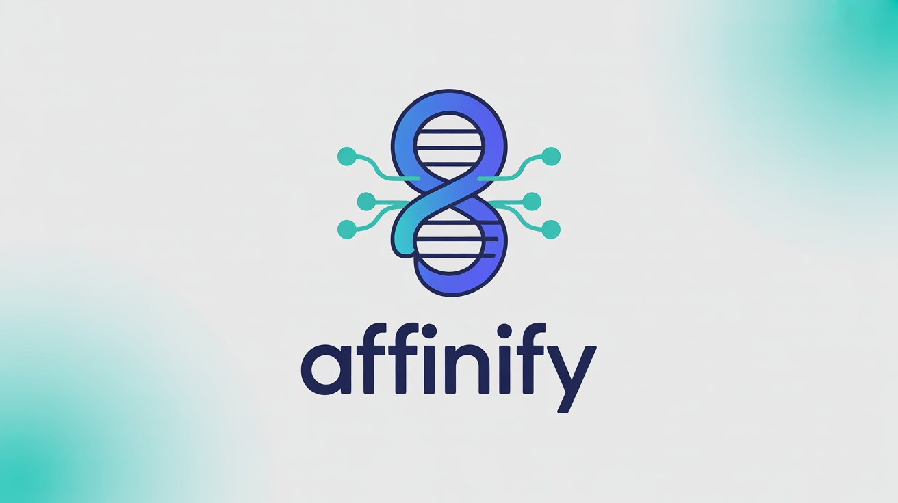

# 🧠 Affinify: Protein-Ligand Binding Affinity Predictor

## Overview

This project implements an AI-powered system to predict binding affinity between proteins and ligands, accelerating drug discovery by computationally identifying promising drug-target interactions before expensive experimental validation. 

## 💡 The Problem

> *"Imagine trying to figure out if a key will fit a lock — but with millions of keys and no idea which lock they go into. This AI helps predict whether a drug (the key) will fit into a protein in the body (the lock), speeding up drug discovery and saving lives."*

Traditional drug discovery is costly and time-consuming, often taking 10-15 years and billions of dollars to bring a single drug to market. Our predictor helps researchers identify the most promising drug candidates early in the pipeline.

## Why It's Like Protein Folding

This project focuses on molecular structure and bioactivity relationships, similar to protein folding problems where 3D structure determines function. Both require understanding complex spatial arrangements and molecular interactions.

## 🎯 Core Concept

- **Input**: Protein and ligand structure data
  - Protein structures from PDB files
  - Ligand structures as SMILES strings or SDF files
- **Output**: Binding affinity score (pKd/pIC50 values)
- **Method**: Multiple approaches including:
  - Molecular descriptors and fingerprints
  - 3D grid-based Convolutional Neural Networks
  - Graph Neural Networks (GNNs)
  - Transformer-based models

## 🚀 Features

- **Multi-modal Input Processing**: Handle both protein 3D structures and ligand molecular representations
- **Ensemble Methods**: Combine multiple prediction approaches for improved accuracy
- **Visualization Tools**: Interactive 3D molecular visualization and binding site analysis
- **Batch Processing**: Efficient screening of large compound libraries
- **Web Interface**: User-friendly platform for researchers without coding experience

## 📊 Datasets

The model is trained on comprehensive binding affinity datasets:

- **BindingDB**: Large collection of measured binding affinities
- **PDBBind**: Curated dataset with 3D protein-ligand complex structures
- **ChEMBL**: Bioactivity database with standardized measurements
- **Custom datasets**: Domain-specific binding data

## 🏗️ Architecture

### 1. Molecular Descriptors Approach
- **Features**: Physicochemical properties, topological indices, fingerprints
- **Models**: Random Forest, XGBoost, Support Vector Regression
- **Advantages**: Fast, interpretable, works with limited 3D data

### 2. 3D Convolutional Neural Networks
- **Input**: Voxelized protein-ligand complexes
- **Architecture**: 3D CNN with attention mechanisms
- **Features**: Captures spatial relationships and binding pocket geometry

### 3. Graph Neural Networks
- **Representation**: Protein and ligand as molecular graphs
- **Models**: Graph Convolutional Networks, Graph Attention Networks
- **Benefits**: Natural representation of molecular structure

### 4. Transformer-Based Models
- **Input**: Protein sequences and molecular SMILES
- **Architecture**: Multi-modal transformers with cross-attention
- **Advantages**: Handles variable-length inputs, captures long-range dependencies

## 🔬 Applications

- **Drug Discovery**: Identify lead compounds for therapeutic targets
- **Drug Repurposing**: Find new uses for existing drugs
- **ADMET Prediction**: Assess drug-like properties early in development
- **Academic Research**: Study protein-ligand interactions and binding mechanisms
- **Pharmaceutical Industry**: Accelerate hit-to-lead optimization

## 📚 References

- BindingDB: https://www.bindingdb.org/
- PDBBind: http://www.pdbbind.org.cn/
- RDKit: https://www.rdkit.org/
- OpenMM: http://openmm.org/